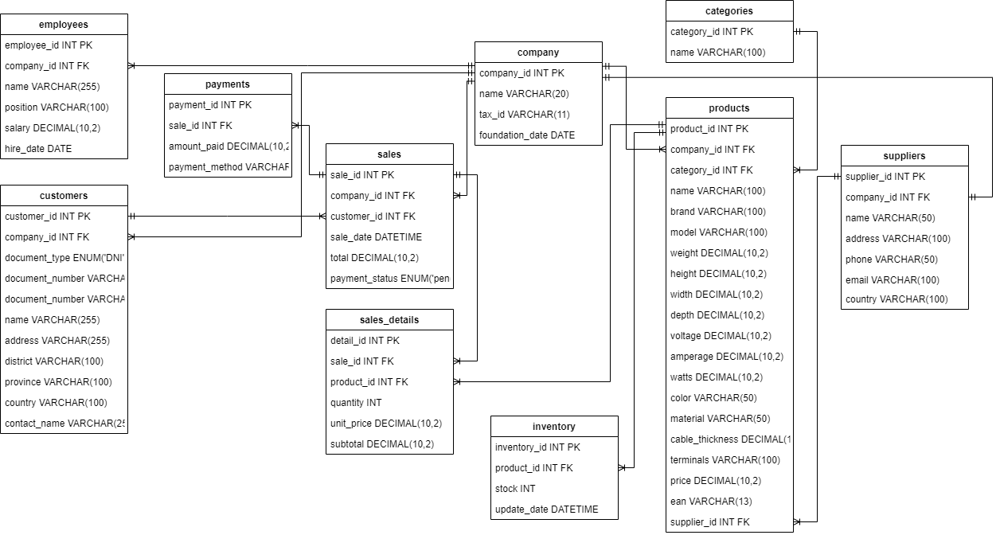
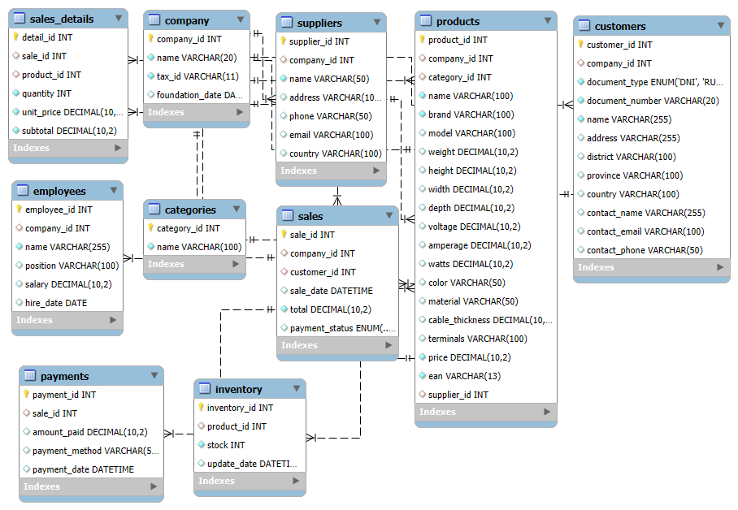

# KJ CORP SQL Database Design  
*End-to-end retail database design and analytics case study*

---

## Overview  

This project presents the **design and implementation of a fully normalized MySQL database** for **KJ CORP**, a Peruvian retail and distribution company specializing in solar energy systems, electronic locks, and hardware products.  

The goal was to migrate from fragmented spreadsheets to a **centralized, high-performance relational database** that ensures **referential integrity**, supports **ETL workflows**, and enables **data-driven decision-making** across supplier management, inventory, sales, and payments.  

Developed as part of the *Master of Data Analytics* program at the **University of Niagara Falls, Canada (2025)**, the project demonstrates practical data engineering, SQL optimization, and BI integration skills.  

---

## 1. Technical Stack  

| Component | Description |
|------------|-------------|
| **Database** | MySQL 8.0 |
| **Modeling Tools** | MySQL Workbench, Draw.io |
| **Languages** | SQL (DDL, DML, DQL) |
| **Visualization** | Power BI, Tableau |
| **Documentation** | Word, PowerPoint, PDF |

---

## 2. Schema Overview  

The schema includes ten normalized tables covering end-to-end retail operations.  

| Core Tables | Description |
|--------------|-------------|
| **Company** | Legal entity and business information |
| **Suppliers** | Vendor registry and terms |
| **Categories** | Product categorization and hierarchy |
| **Products** | Brand, model, price, and product attributes |
| **Inventory** | Real-time stock tracking |
| **Customers** | End-customer master data |
| **Sales** | Main transaction records |
| **Sales_Details** | Line-item breakdown per sale |
| **Payments** | Transactions and accounts receivable/payable |
| **Employees** | Staff and internal roles |

Database fully adheres to **Third Normal Form (3NF)** to eliminate redundancy and improve query performance.

---

## 3. Repository Contents  

| Type | File | Description |
|------|------|-------------|
| **Report** | [KJCorp_SQL_Report_Professional.pdf](docs/KJCorp_SQL_Report_Professional.pdf) | Executive summary with design and business insights |
| **Presentation** | [KJCorp_SQL_Presentation_Professional.pdf](docs/KJCorp_SQL_Presentation_Professional.pdf) | Visual overview for recruiters and portfolio use |
| **Conceptual ERD** |  | Conceptual schema designed in Draw.io |
| **Technical ERD** |  | Reverse-engineered MySQL Workbench model |
| **SQL Script** | [kjcorp_schema_and_queries.sql](sql/kjcorp_schema_and_queries.sql) | Complete database creation, sample data, and analytics queries |

---

## 4. How to Run  

To create and populate the database locally using MySQL Workbench:  
```sql
SOURCE ./sql/kjcorp_schema_and_queries.sql;
```
This script:

- Creates the database `KJCorpDB`  
- Defines all tables, constraints, and relationships  
- Inserts anonymized sample data  
- Runs analytical queries for reporting and insights  

After execution, refresh the schema in **MySQL Workbench** — all tables will be available and populated.

---

## 5. Sample Analytical Queries
```
-- Top-selling products
SELECT p.name, SUM(sd.quantity) AS total_sold
FROM Sales_Details sd
JOIN Products p ON sd.product_id = p.product_id
GROUP BY p.name
ORDER BY total_sold DESC;

-- Total revenue by customer
SELECT c.name AS customer, SUM(s.total_amount) AS revenue
FROM Sales s
JOIN Customers c ON s.customer_id = c.customer_id
GROUP BY c.name;
```
These queries demonstrate **query optimization**, **JOIN logic**, and **aggregation for BI integration** in Power BI or Tableau dashboards.

---

## 6. Technical Highlights  

- **Advanced SQL design** with constraints ensuring **referential integrity**  
- **Query optimization and indexing** for performance efficiency  
- **Data modeling and normalization (up to 3NF)**  
- **ETL-ready architecture** for integration with BI tools  
- **Business-oriented schema** enabling real-time retail analytics  

---

## 7. Business Impact  

- Centralized and reliable company data (**zero redundancy**)  
- Enhanced operational reporting on **suppliers, sales, inventory, and payments**  
- Scalable foundation for **predictive analytics and dashboards**  
- Demonstrated ability to **bridge business logic and technical implementation**  

---

## 8. Skills Demonstrated  

`SQL` · `Database Design` · `ETL Workflows` · `Data Modeling` · `Normalization (3NF)` · `Referential Integrity` · `Query Optimization` · `Business Intelligence` · `Power BI` · `Tableau` · `Analytical Thinking`  

---

## 9. Quick Links  

- **LinkedIn:** [linkedin.com/in/joseayonwu](https://www.linkedin.com/in/joseayonwu)  
- **GitHub Portfolio:** [github.com/joseayonwu](https://github.com/joseayonwu)  
- **Email:** [joseayonwu@gmail.com](mailto:joseayonwu@gmail.com)  

---

*If you found this project useful, please ⭐ the repository and connect on LinkedIn.*  
© 2025 **José Antonio Ayón Wu** | *Master of Data Analytics, University of Niagara Falls, Canada*  
