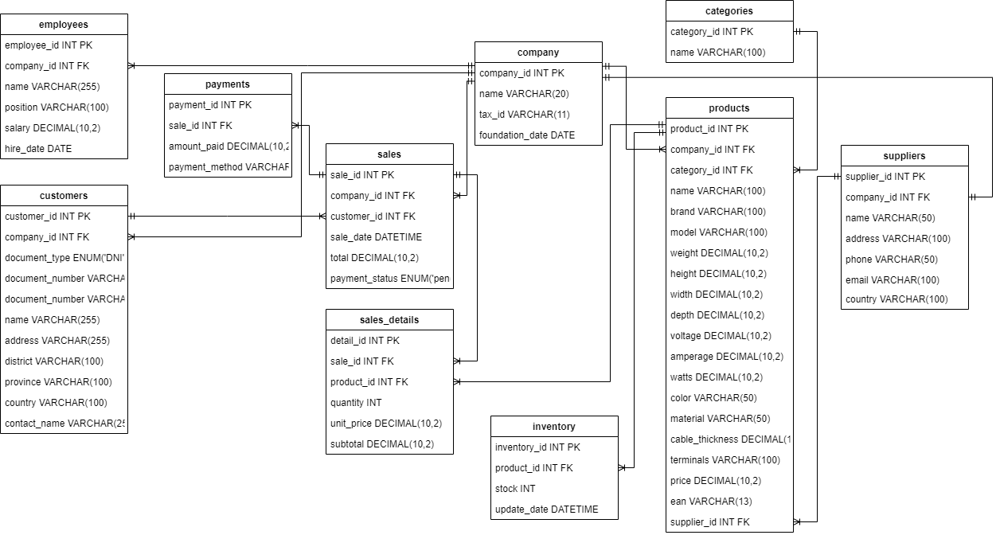

# 🏢 KJ CORP SQL Database Design
### Database design and analytics case study in retail operations  

Developed by **Jose Ayon Wu**  
*Data Analytics | SQL | Power BI | Python | Tableau | Excel*  
📧 **Email:** joseayonwu@gmail.com  
🔗 **LinkedIn:** [linkedin.com/in/joseayonwu](https://www.linkedin.com/in/joseayonwu)  
💻 **GitHub Portfolio:** [github.com/joseayonwu](https://github.com/joseayonwu)

---

## 📘 Project Overview
This project presents the **design and implementation of a professional MySQL database** for **KJ CORP**, a Peruvian retail and distribution company specializing in solar energy systems, electronic locks, and hardware products.  

The goal was to migrate from manual spreadsheets to a **centralized, normalized SQL schema** that ensures data integrity, enables analytical reporting, and supports decision-making across supplier management, inventory, sales, and payments.  

The entire system was developed as part of the **Master of Data Analytics program at the University of Niagara Falls Canada (2025)**.

---

## ⚙️ Technical Stack
| Component | Description |
|------------|--------------|
| **Database** | MySQL 8.0 |
| **Modeling Tools** | MySQL Workbench, Draw.io |
| **Languages** | SQL (DDL, DML, DQL) |
| **Visualization** | Power BI, Tableau |
| **Documentation** | Word, PowerPoint, PDF |

---

## 🧩 Schema Overview
The database contains **10 normalized tables** supporting key retail operations:

| Core Tables | Description |
|--------------|--------------|
| `Company` | Company information and legal details |
| `Suppliers` | Vendor master data |
| `Categories` | Product grouping and classification |
| `Products` | Product-level details (brand, model, price) |
| `Inventory` | Stock tracking per product |
| `Customers` | End-customer registry |
| `Sales` | Main transaction records |
| `Sales_Details` | Line-item transaction details |
| `Payments` | Sales and supplier payments |
| `Employees` | Staff and internal roles |

---

## 📊 Project Files
| Type | File | Description |
|------|------|-------------|
| 🧾 **Report** | [KJCorp_SQL_Report_Professional.pdf](docs/KJCorp_SQL_Report_Professional.pdf) | Executive report summarizing design, insights, and business impact |
| 🖥️ **Presentation** | [KJCorp_SQL_Presentation_Professional.pdf](docs/KJCorp_SQL_Presentation_Professional.pdf) | Visual overview of the database design for recruiters and LinkedIn |
| 🧩 **Conceptual ERD** |  | Logical schema designed in Draw.io (conceptual model) |
| 🧠 **Technical ERD** |  | Reverse-engineered model generated from MySQL Workbench |
| 💾 **SQL Script** | [kjcorp_schema_and_queries.sql](sql/kjcorp_schema_and_queries.sql) | Complete SQL schema with creation, sample data, and analytical queries |

---

## 🚀 How to Run
To create and populate the database locally, open MySQL Workbench and execute:

```sql
SOURCE ./sql/kjcorp_schema_and_queries.sql;
```
This single script:

Creates the database KJCorpDB
Defines all normalized tables and relationships
Inserts anonymized sample data
Runs analytical queries for reporting and insights

After execution, refresh the schema list in MySQL Workbench — you should see all tables with data loaded.

📈 Analytical Queries (Samples)

Example queries included in the project:

-- Top-selling products
SELECT p.name, SUM(sd.quantity) AS total_sold
FROM Sales_Details sd
JOIN Products p ON sd.product_id = p.product_id
GROUP BY p.name
ORDER BY total_sold DESC;

-- Total revenue by customer
SELECT c.name AS customer, SUM(s.total_amount) AS revenue
FROM Sales s
JOIN Customers c ON s.customer_id = c.customer_id
GROUP BY c.name;

These queries support future integration with Power BI or Tableau dashboards for advanced analytics.

📚 Key Learning Outcomes

Advanced SQL database design and normalization

Referential integrity through primary/foreign keys

Query optimization and indexing for performance

Business-driven data modeling for retail analytics

Integration readiness with BI tools

🏁 Results & Business Impact

✅ Centralized company data with zero redundancy

✅ Improved operational reporting (suppliers, sales, inventory)

✅ Scalable foundation for predictive analytics and dashboards

✅ Demonstrated real-world data engineering and modeling skills

🧠 Skills Demonstrated

SQL • Database Design • Data Modeling • Normalization • ETL • Business Intelligence • Power BI • Tableau • Analytical Thinking

🔗 Quick Links

📘 LinkedIn: linkedin.com/in/joseayonwu

💻 GitHub Portfolio: github.com/joseayonwu

📧 Email: joseayonwu@gmail.com

⭐ If you found this project useful, feel free to star the repository and connect on LinkedIn!
